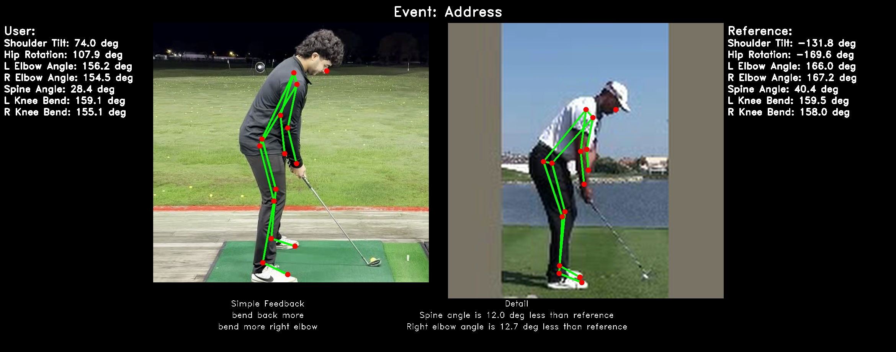
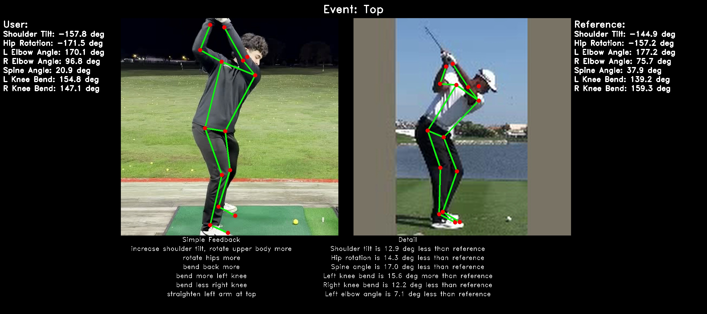
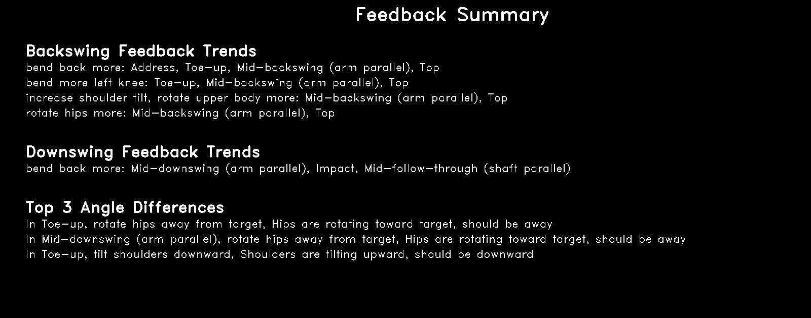

# SwingLikeAPro ⛳🏌️💻

_A golf swing analysis system that compares your biomechanics with professional golfers using AI and computer vision._





## 🚀 Overview

SwingLikeAPro is designed to help golfers of all levels enhance their swing mechanics. By leveraging advanced AI and computer vision, it:
- Automatically detects 8 key phases of your golf swing, from address to finish.
- Analyzes 7 critical biomechanical angles to assess your form.
- Provides personalized feedback and suggestions for improvement.
- Offers visual comparisons with professional golfers' swings.
- Demonstrates proven results, with users experiencing an average distance gain of 4.5 meters and a reduction in shot curvature by 1.3 meters.


## 🔍 Key Features

### 🎯 Swing Phase Detection
The system uses a sophisticated LSTM neural network to identify 8 critical events in your golf swing:
1. **Address**: The starting position.
2. **Toe-up**: When the club is parallel to the ground.
3. **Mid-backswing**: Halfway through the backswing.
4. **Top**: The peak of the backswing.
5. **Mid-downswing**: Halfway through the downswing.
6. **Impact**: The moment of ball contact.
7. **Mid-follow-through**: After impact.
8. **Finish**: The completion of the swing.

### 📐 Biomechanical Analysis
Measures seven critical angles:
- Shoulder tilt
- Hip rotation
- Left and right elbow angles
- Spine angle
- Left and right knee angles
These measurements provide insights into your posture and movement efficiency.

### 📊 Smart Feedback System
- Rule-based engine with 10° sensitivity threshold
- Generates personalized improvement suggestions
- Provides professional comparison overlays

## ⚙️ Technical Architecture

```
Input Video (.mp4)
   │
   ├──▶ Preprocessing (Resizing, Orientation Correction)
   │        └─ Ensures correct aspect ratio and upright positioning for both user and reference videos
   │
   ├──▶ LSTM Neural Network (Swing Phase Detection)
   │
   ├──▶ MediaPipe Pose Estimation (Joint Detection)
   │
   ├──▶ Angle Calculation (Biomechanics Analysis)
   │
   ├──▶ Feedback Engine (Suggestions & Thresholds)
   │
   └──▶ Visualization (Side-by-side Comparison Frames & Summary Report)
```

## 📦 Installation

1. **Clone the repository**:
   ```bash
   git clone https://github.com/yourusername/SwingLikeAPro.git
   cd SwingLikeAPro
   ```

2. **Install dependencies**:
   ```bash
   pip install -r requirements.txt
   ```

3. **Download pretrained models**:
   - Create a directory:
     ```bash
     mkdir -p models/
     ```
   - Download and place models:
     - **MobileNetV2 weights**:
       - Download from: https://github.com/tonylins/pytorch-mobilenet-v2
       - Place in `models/` directory.
     - **SwingNet model**:
       - Download from: https://drive.google.com/file/d/1MBIDwHSM8OKRbxS8YfyRLnUBAdt0nupW/view
       - Place in `models/` directory.

---

## 🏌️ How to Use

### 🛠️ Step 1: Preprocess Your Videos

Before running the analysis, it's important to preprocess the videos to ensure correct orientation and size. This avoids issues such as sideways videos or incorrect aspect ratios.

Use the provided `preprocess_video.py` script on **both your swing video** and the **reference video**.

**Note**: You may have to run this multiple times on a video, to ensure the processed video is upright.

Edit the `__main__` section as needed
```bash
if __name__ == '__main__':
    input_video = 'video_to_be_processed.mp4'     # Replace with your input file path
    output_video = 'output_video_name.mp4'        # Replace with your desired output path
    preprocess_local_video(input_video, output_video, dim=400, rotate=True)
```

**Configuration Options:**
- `rotate=True` or `False` depending on video orientation. If videos are sideways when running `analyse_swing.py` then change this variable
- `dim=400` for output video resolution (adjustable)

### 🎥 Step 2: Analyze Your Swing

Run the analysis with:

```bash
python analyse_swing.py -p your_swing.mp4  --reference reference_swing.mp4
```

### ✅ Example

```bash
python analyse_swing.py -p test_video.mp4 --reference tiger_swing.mp4
```

### 📁 Results

Generated output will be as images stored in:

```
├── user_event_frames/                     # Your key swing frames
├── reference_event_frames/                # Professional reference frames
├── combined_images/                       # Side-by-side analysis frames
└── combined_images/feedback_summary.jpg   # Visual feedback summary
```
